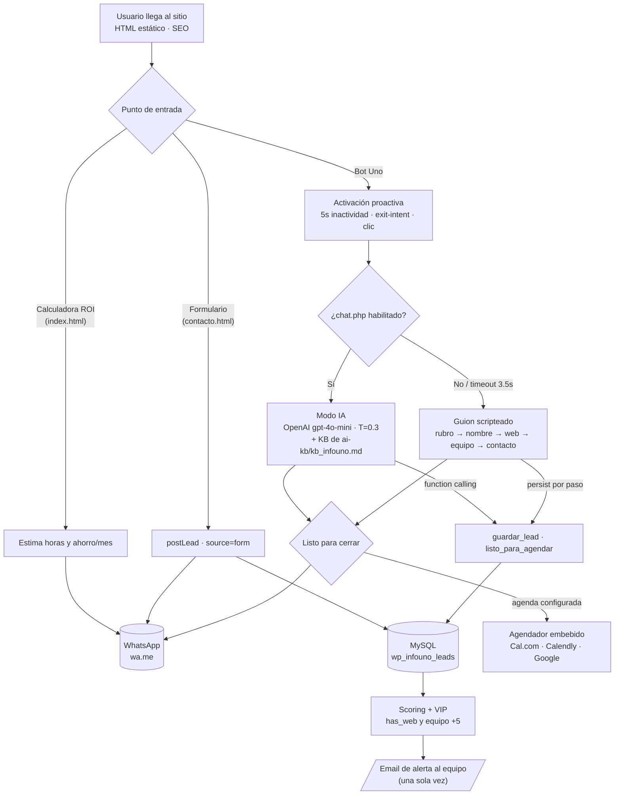

# Infouno — Agencia IA

Sitio corporativo + chatbot conversacional "Uno" para PyMEs argentinas.

## 🎯 Objetivo del proyecto

**Generar y cualificar leads comerciales** mediante un agente de IA, manteniendo un sitio **rápido e indexable**.

El sitio funciona como una **máquina de captación de leads**: atrae tráfico (SEO), engancha al visitante con un bot proactivo y una calculadora de ROI, captura sus datos de forma natural (sin interrogatorio), los **persiste paso a paso** en MySQL con *scoring* automático, y lleva la conversación a una **consultoría gratuita de 15 min** (agenda embebida o WhatsApp). Cada lead relevante dispara una **alerta por email** al equipo comercial, marcando los **VIP** (negocio con web previa + equipo grande).

Objetivos concretos:

- **Captar** rubro, nombre, estado web, tamaño de equipo, WhatsApp y email — en orden natural.
- **No perder leads**: persistencia asíncrona por paso (aunque el usuario abandone).
- **Cualificar**: *lead scoring* y detección de "Lead VIP" para priorizar.
- **Convertir**: cierre hacia agenda online y/o WhatsApp.
- **Cumplir**: rendimiento (LCP < 2.5s), SEO, seguridad y Ley 25.326.

> Detalle de negocio en [`ai/analysis.md`](ai/analysis.md), reglas en [`ai/rules.md`](ai/rules.md) y guardrails en [`ai/guardrails.md`](ai/guardrails.md).

## 🔄 Diagrama de flujo



**Cómo leerlo:** hay tres puntos de entrada (calculadora, formulario y bot). El bot "Uno" decide en runtime entre **modo IA** (`chat.php` → OpenAI) o **guion scripteado** según disponibilidad. En ambos modos, cada dato se **persiste por paso** en `wp_infouno_leads` vía `lead.php`/`db_lead.php`, que calcula *scoring*, marca VIP y avisa por email. El cierre ofrece **agenda embebida y/o WhatsApp**.

## 🧱 Capas (arquitectura)

| Capa | Hoy | Objetivo |
|---|---|---|
| Presentación | HTML estático (7 páginas) + `assets/site.js` | WordPress v6+ + Elementor |
| Cognitiva (IA) | `chat.php` → OpenAI `gpt-4o-mini` (T=0.3), function calling, fallback al guion | + RAG selectivo |
| Datos | MySQL `wp_infouno_leads` (`lead.php` / `db_lead.php`) | + CRM / Google Calendar |
| Orquestación | — | Make / Node.js (webhooks) |

> Arquitectura objetivo completa en [`ai/architecture.md`](ai/architecture.md).

## 🗂️ Estructura

```text
index.html · nosotros · servicios · soluciones-ia · casos · contacto · privacidad
assets/site.js     Lógica frontend: bot (IA + guion), calculadora, agenda, leads, Tweaks
chat.php           Proxy del bot a OpenAI (function calling + fallback)
lead.php           Recepción de leads (formulario + bot)
db_lead.php        Persistencia: sanitización, validación, scoring/VIP, upsert, email
config.php         Credenciales (NO se versiona) · plantilla en config.sample.php
ai-kb/kb_infouno.md  Base de conocimiento del bot
db/schema.sql      DDL de wp_infouno_leads
ai/                Documentación: protocolo, análisis, arquitectura, reglas, guardrails, checks
```

## 🚀 Correr en local

- **Solo frontend:** abrir los `.html` o `python3 -m http.server`. Sin `chat.php`, el bot cae al guion scripteado.
- **Con backend:** requiere PHP + MySQL → `php -S localhost:8000` con un `config.php` completo. En producción corre en DonWeb/cPanel.

## 🤖 Para Claude Code

Antes de cualquier tarea, seguir el protocolo de [`CLAUDE.md`](CLAUDE.md): `ai/templates/execution.md` → `ai/context-loader.md` → `ai/analysis.md`.
